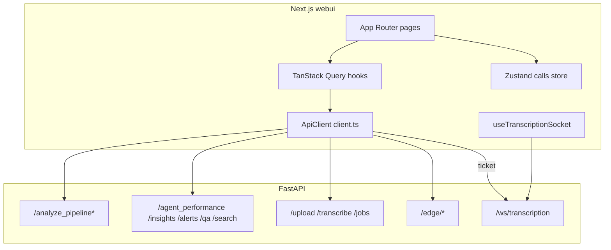

# Frontend ↔ Backend-harmoni

**Datum:** 2026-07-17  
**Scope:** Next.js `webui/` mot FastAPI `src/api/`  
**Syfte:** Beslutsunderlag för att synka kontrakt, auth, WS och Fas 4-yta före kundpilot  
**Relaterat:** [PILOT_RUNBOOK.md](PILOT_RUNBOOK.md), [DECISION_REPORT_2026-07-17.md](DECISION_REPORT_2026-07-17.md), [API.md](API.md)

---

## 1. Verdict

### Conditional harmony — kärnflödet fungerar, kontraktet driver

Dashboardens huvudväg (`POST /analyze_pipeline` → typed `AnalyzerResults` → sidor) är i praktiken i fas med backend. Harmonin bryts på **auth i browser**, **ofullständig Fas 4-yta**, **manuell typdrift** (ingen genererad OpenAPI-klient) och **e2e som inte bevisar live API**.

| Dimension | Bedömning |
|-----------|-----------|
| Pipeline + Testlabb + Edge | Stark |
| Transcription REST + WS | Medel (job-API oanvänd i UI; WS-typer ofullständiga) |
| Fas 4 aggregates | Medel (hot topics + agent perf; saknar semantic/QA; alerts dual path) |
| Auth (REST + WS) | BFF default (`SENTIMENT_API_KEY` server-side); WS via ticket |
| Kontrakt / OpenAPI | `webui/openapi.json` + `schema.ts` + CI drift check |
| E2E vs live backend | Svag — Playwright stubbar/mockar; smoke träffar riktig `:8000` utan stub |

**Pilot-implikation:** UI kan demo:a hybridanalys, men prod med `SENTIMENT_API_KEY` kräver att API-nyckel faktiskt skickas från webui. Live `/testlab`-pass (PRODUCTION_CHECKLIST) är fortfarande nödvändig.

---

## 2. Arkitektur (nuvarande)

**Dominant pattern:** De flesta sidor kör `useDemoReports` → N× `/analyze_pipeline` på demo-transcripts *eller* localStorage-calls från transcription-flödet. Aggregat (executive, alerts-lista) beräknas ofta **klient-side** från cachade reports i stället för dedikerade Fas 4-endpoints.

---

## 3. Täckningsmatris

### 3.1 Backend → Frontend

| Backend | I `ApiClient` | I UI / hook | Kommentar |
|---------|---------------|-------------|-----------|
| `GET /health` | Ja | Ja (header) | OK |
| `POST /analyze_pipeline` | Ja | Ja (kärna) | OK |
| `POST /analyze_pipeline/partial` | Ja | Ja (`/testlab`) | OK |
| `POST /analyze_pipeline/compare` | Ja | Ja (`/testlab`) | OK |
| `POST /agent_performance/{id}` | Ja | Ja (`/agents`) | Fallback local om fail |
| `POST /insights/hot_topics` | Ja | Ja (`/insights`) | OK |
| `POST /alerts` | Ja | **Nej** | UI läser `results.alerts` från pipeline |
| `GET /alerting/status` + reset | Ja | Ja | OK |
| `POST /upload` + `/transcribe` | Ja | Ja | OK |
| `GET/POST /transcription/jobs*` | Ja | Ja (`/transcription`) | Jobs-panel + cancel |
| `POST /batch_transcribe` | Ja | **Nej** | — |
| WS ticket + `/ws/transcription` | Ja | Ja | `partial_analysis` saknas i TS-union |
| `POST /edge/*` | Ja | Ja | OK |
| `POST /search/semantic` | Ja | Ja (`/insights`) | SemanticSearchPanel |
| `POST /qa/score` | Ja | Ja (`/insights`) | QaScorePanel vs pipeline |
| `POST /analyze` | Nej | Nej | Text-only API |
| `POST /analyze_conversation*` | Nej | Nej | Ersatt av pipeline i UI |
| `POST /scan_process` | Nej | Nej | CLI/ops |
| `GET /status/*`, `/metrics` | Delvis / nej | **Nej** | Ops-yta saknas i dashboard |

### 3.2 Frontend-sidor → backend-beroende

| Sida | Primär backend | Risk |
|------|----------------|------|
| `/`, `/analytics`, `/analysis`, `/calls/[id]` | `/analyze_pipeline` (demo eller store) | Demo-beroende utan riktiga calls |
| `/agents` | pipeline + `/agent_performance` | Tyst local-fallback döljer API-fel |
| `/insights` | pipeline + `/hot_topics` + alerting status | Alerts ej via `/alerts` |
| `/executive` | Endast klient-aggregat | Ingen server-side executive API |
| `/transcription` | upload → transcribe → pipeline + WS | Job-lista/cancel oanvänd |
| `/testlab` | pipeline / partial / compare | Bästa kontraktstestytan |
| `/edge` | edge endpoints | OK |

---

## 4. Disharmonier (prioriterade)

### P0 — Blockerar prod-pilot med auth

| ID | Problem | Evidens | Åtgärd |
|----|---------|---------|--------|
| H1 | ~~`ApiClient`-singleton sätter aldrig `apiKey`~~ **DONE 2026-07-17** | `NEXT_PUBLIC_API_KEY` → singleton; header visar 401/auth_required; Docker build-arg | Verifiera i staging med nyckel |
| H2 | ~~Playwright smoke stubbar bara `/health`~~ **DONE** | `e2e/helpers/mock-api.ts` + smoke | Manuell live `/testlab` kvar (H3) |
| H3 | Live webui↔API ej i e2e | PRODUCTION_CHECKLIST L-webui | Behåll manuell `/testlab`-gate; lägg optional live e2e-jobb |

### P1 — Kontraktsdrift och Fas 4-hälsa

| ID | Problem | Evidens | Åtgärd |
|----|---------|---------|--------|
| H4 | ~~OpenAPI-typer genereras inte~~ **DONE 2026-07-17** | `webui/openapi.json` + `schema.ts` + `paths.ts` | Kör `npm run sync:openapi` efter API-ändringar |
| H5 | ~~`POST /search/semantic` utan UI~~ **DONE** | `SemanticSearchPanel` på `/insights` | — |
| H6 | ~~`POST /qa/score` utan UI~~ **DONE** | `QaScorePanel` jämför pipeline vs API | — |
| H7 | ~~Dubbel alerts-väg~~ **DONE** | `useAlerts` → POST `/alerts` med pipeline-fallback | Badge visar API/Pipeline-källa |
| H8 | ~~WS `partial_analysis` saknas~~ **DONE** | `PartialAnalysisEvent` + loggrad i WS-hook | — |

### P2 — UX/ops polish

| ID | Problem | Åtgärd |
|----|---------|--------|
| H9 | ~~Job-API oanvänd~~ **DONE** | `TranscriptionJobsPanel` på `/transcription` | — |
| H10 | `dialect` mappas men ingen DialectCard | Lägg kort eller sluta extrahera |
| H11 | Agent `source: api\|local` dolt | Visa badge “API / lokal fallback” |
| H12 | Unavailable-kort försvinner (`null`) | Visa “Ej tillgänglig (deep path)” placeholder utöver TrustSurface |
| H13 | `docs/API.md` WS-auth delvis stale | Synka med ticket + `?token=` |
| H14 | `NEXT_PUBLIC_*` bake-at-build i Docker | Dokumentera rebuild-krav i PILOT_RUNBOOK |

---

## 5. ce-pov — rekommenderade lås (mot detta projekt)

### 5.1 Auth-modell för webui — **Conditional adopt: env key + dokumenterad begränsning**

| Floor | Faktum |
|-------|--------|
| Projekt | Backend `X-API-Key`; WS ticket via authenticated GET |
| Frontend | `apiKey` stöds i klassen men singleton får den aldrig |

**Verdict:** För pilot: sätt `NEXT_PUBLIC_API_KEY` från samma secret som `SENTIMENT_API_KEY` **endast** i betrodda interna nät (nyckel syns i browser). Medellång sikt: Next.js BFF/route-handler som håller nyckeln server-side. Reject “auth disabled in prod”.

### 5.2 OpenAPI-genererade typer — **Adopt**

| Floor | Faktum |
|-------|--------|
| Projekt | Manuell spegling av `schemas.py` i `client.ts`; generate-script finns |
| Risk | Fas 5 analyzer-fält driver typdrift |

**Verdict:** Generera `schema.ts` i CI; behåll handskrivna helpers men basera request/response på genererade types.

### 5.3 Fas 4 orphans (semantic / qa/score) — **Hold UI, keep API**

Inte ta bort backend. Prioritera semantic search i Insights när pilotkunden efterfrågar sök; QA via pipeline räcker tills dedikerad scorecard-UI behövs. Dokumentera orphans så de inte säljs som “i dashboarden”.

### 5.4 Demo-first dashboard — **Hold for pilot, path to real**

`useDemoReports` + transcription→localStorage är acceptabelt för conditional pilot. Kräv att one-pager/demo-läge är tydligt märkt; prod-pilot ska fylla store via `/transcription` eller importerad korpus.

---

## 6. 30-dagars harmoniplan (FE/BE)

### Vecka 1 — P0

1. Wire `NEXT_PUBLIC_API_KEY` → `ApiClient` (+ env.example, Docker build-arg).
2. Header: visa 401/auth-fail tydligt (inte bara “API ej tillgänglig”).
3. Stabilisera smoke e2e: stubba `/analyze_pipeline` (som analyzer-cards) *eller* markera smoke som `needs: api`.

### Vecka 2 — P1 kontrakt

4. `npm run generate:types` + commit `schema.ts` eller CI-artefakt; fail on drift.
5. Lägg `PartialAnalysisEvent` i `transcription-events.ts`; logga i WS-hook.
6. Alerts: antingen använd `getAlerts` för aggregate-vy eller ta bort oanvänd metod + uppdatera docs.

### Vecka 3–4 — P1/P2 produkt

7. Insights: minimal semantic search-panel (`POST /search/semantic`) *eller* API.md “API-only”.
8. Transcription: job-lista från `/transcription/jobs` + cancel.
9. Honest degradation: placeholder-kort i stället för tysta `null`.
10. Manuell live `/testlab` checklist-item kvar som hard gate.

---

## 7. Harmoni-scorecard (nuläge)

| Yta | Score (1–5) | Notis |
|-----|-------------|-------|
| Pipeline typed results | 5 | Stark spegling Fas 5 |
| Testlabb A/B | 5 | Bästa kontraktytan |
| Edge | 4 | Enkel, komplett |
| Transcription | 3 | Funkar; jobs/partial underutnyttjade |
| Fas 4 insights | 3 | Hot topics ja; search/QA nej |
| Auth prod | 4 | BFF default; DIRECT escape hatch |
| OpenAPI sync | 4 | Snapshot + CI drift job |
| E2E bevis | 2 | Stubbar/mockar |

**Snitt ~3.8/5** — tillräckligt för *demo/conditional pilot*; live `/testlab` still required.

---

## 8. Källor (interna)

- `webui/src/lib/api/client.ts`
- `webui/src/hooks/*`, `webui/src/app/**/page.tsx`
- `webui/e2e/smoke.spec.ts`, `webui/e2e/analyzer-cards.spec.ts`
- `src/api/app.py`, `src/api/routers/*`, `src/api/schemas.py`
- `src/api/transcription_events.py`, `src/api/ws_tickets.py`
- `docs/API.md`, `docs/PRODUCTION_CHECKLIST.md`

---

*Analys only — ingen produktkod ändrad i detta dokument. Nästa implementation bör börja med H1–H4.*
